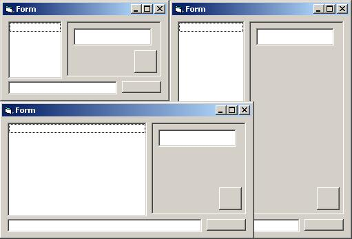

<div align="center">

## Anchor Class


</div>

### Description

Anchors, makes controls size along with the form.

I wanted to use anchors in VB and make this class in order to save some time. I hope you'll find it usefull.
 
### More Info
 
You need to know how to use classes


<span>             |<span>
---                |---
**Submitted On**   |
**By**             |[Ferry Timmers](https://github.com/Planet-Source-Code/PSCIndex/blob/master/ByAuthor/ferry-timmers.md)
**Level**          |Intermediate
**User Rating**    |4.8 (24 globes from 5 users)
**Compatibility**  |VB 3\.0, VB 4\.0 \(16\-bit\), VB 4\.0 \(32\-bit\), VB 5\.0, VB 6\.0
**Category**       |[VB function enhancement](https://github.com/Planet-Source-Code/PSCIndex/blob/master/ByCategory/vb-function-enhancement__1-25.md)
**World**          |[Visual Basic](https://github.com/Planet-Source-Code/PSCIndex/blob/master/ByWorld/visual-basic.md)
**Archive File**   |[](https://github.com/Planet-Source-Code/ferry-timmers-anchor-class__1-55233/archive/master.zip)


### Source Code

```
'-----------------------------------------------------
'         Costum Anchor Class
'            for VB
'        by Ferry "FTPlus" Timers
'-----------------------------------------------------
'
' Usage: (in 4 steps)
'
' 1. Declare as a new class
'
' example: Dim ancTextbox1 as new Anchor
'
' 2. Initalize the anchor and hook the control to the class (init before movement)
'  (it remembers the margins)
'
' example: anc.Textbox1.Init Textbox1
'
' 3. Set the anchor points (Left, Top, Right, Bottom)
'
' example: ancTextbox1.SetAnchors True, False, True, True
'
' 4. And Finaly lets justify the sizes (best to place in Form_Resize)
'
' example: ancTextbox1.Update
'
'-----------------------------------------------------
'           Have Fun
'-----------------------------------------------------
Private Type tAnchor
 Left As Boolean
 Top As Boolean
 Right As Boolean
 Bottom As Boolean
End Type
Public Container As Object
Private Anchors As tAnchor
Private marginLeft As Integer
Private marginTop As Integer
Private marginRight As Integer
Private marginBottom As Integer
Public Sub Init(ByRef Obj As Object)
Set Container = Obj
With Container
 marginLeft = .Left
 marginTop = .Top
 marginRight = .Container.Width - .Left - .Width
 marginBottom = .Container.Height - .Top - .Height
End With
End Sub
Public Sub SetAnchors(Left As Boolean, Top As Boolean, Right As Boolean, Bottom As Boolean)
With Anchors
 .Left = Left
 .Top = Top
 .Right = Right
 .Bottom = Bottom
End With
End Sub
Public Sub Update()
Dim I As Integer
If Anchors.Left Then
 Container.Left = marginLeft
 If Anchors.Right Then
  I = Container.Container.Width - marginLeft - marginRight
  If I > 0 Then Container.Width = I
 End If
ElseIf Anchors.Right Then
 I = Container.Container.Width - Container.Width - marginRight
 If I > 0 Then Container.Left = I
End If
If Anchors.Top Then
 Container.Top = marginTop
 If Anchors.Bottom Then
  I = Container.Container.Height - marginTop - marginBottom
  If I > 0 Then Container.Height = I
 End If
ElseIf Anchors.Bottom Then
 I = Container.Container.Height - Container.Height - marginBottom
 If I > 0 Then Container.Top = I
End If
End Sub
```

